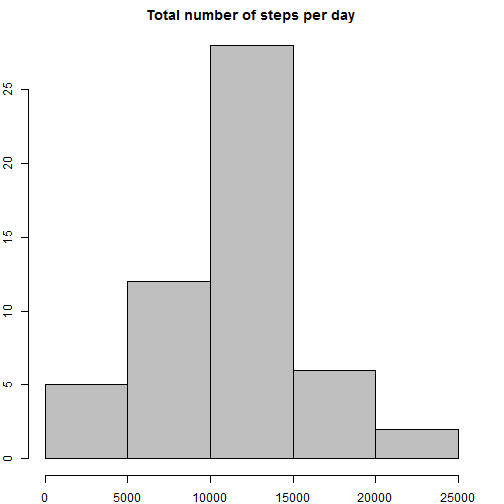
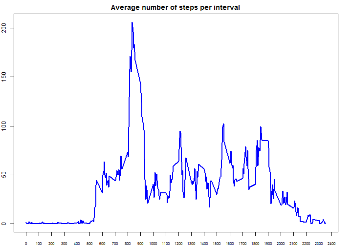
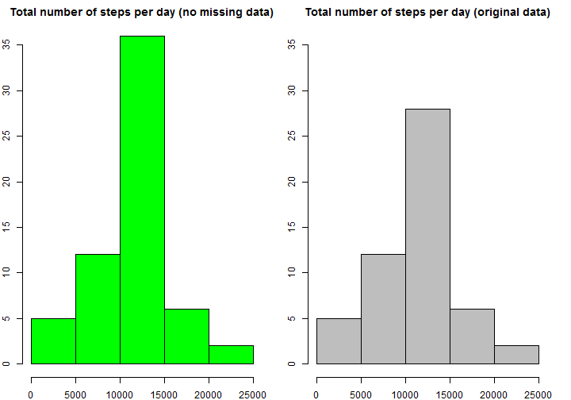
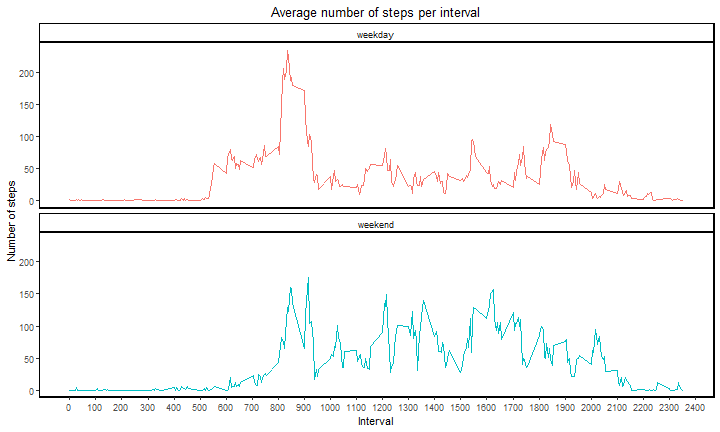

# Reproducible Research
# Peer-graded Assignment: Course Project 1  


### 1. Loading and preprocessing the data  
#### 1.1. Downloading the data

```r
dataUrl <- "https://d396qusza40orc.cloudfront.net/repdata%2Fdata%2Factivity.zip"
download.file(dataUrl, "Factivity.zip")
unzip("Factivity.zip")
```

#### 1.2. Reading the data

```r
datax <- read.csv("activity.csv")
datax$date <- as.Date(as.character(datax$date))
str(datax)
```

```
## 'data.frame':	17568 obs. of  3 variables:
##  $ steps   : int  NA NA NA NA NA NA NA NA NA NA ...
##  $ date    : Date, format: "2012-10-01" "2012-10-01" ...
##  $ interval: int  0 5 10 15 20 25 30 35 40 45 ...
```


### 2. What is mean total number of steps taken per day?  
#### 2.1. Making a histogram of the total number of steps taken each day

```r
datay <- aggregate(steps ~ date, data = datax, sum)
str(datay)
```

```
## 'data.frame':	53 obs. of  2 variables:
##  $ date : Date, format: "2012-10-02" "2012-10-03" ...
##  $ steps: int  126 11352 12116 13294 15420 11015 12811 9900 10304 17382 ...
```

```r
par(mar = c(2, 2, 2, 2))
hist(datay$steps, main = "Total number of steps per day", col = "grey")
```



#### 2.2. Calculating and reporting the mean and median total number of steps taken per day

```r
library(knitr)
inline_hook <- function(x) {
    if(is.numeric(x)) x <- round(x, 0)
    paste(as.character(x), collapse=", ")
}
knit_hooks$set(inline = inline_hook)

MeanSteps <- mean(datay$steps)
MedianSteps <- median(datay$steps)
```
MEAN: <span style="color:red">10765</span>  
MEDIAN: <span style="color:red">10765</span>  


### 3. What is the average daily activity pattern?  
#### 3.1. Making a time series plot of the 5-minute interval (x-axis) and the average number of steps taken, averaged across all days (y-axis).

```r
dataz <- aggregate(steps ~ interval, data = datax, mean)
str(dataz)
```

```
## 'data.frame':	288 obs. of  2 variables:
##  $ interval: int  0 5 10 15 20 25 30 35 40 45 ...
##  $ steps   : num  1.717 0.3396 0.1321 0.1509 0.0755 ...
```

```r
par(mar = c(2, 2, 2, 2))
plot(dataz$interval, dataz$steps, type = "l",
     xaxt="n",
     main = "Average number of steps per interval",
     col="blue", lwd=2)
axis(1, seq(0,2400,100), cex.axis=0.7)
```



#### 3.2. Finding 5-minute interval which,  on average across all the days in the dataset, contains the maximum number of steps.

```r
maxInt <- subset(dataz, steps == max(steps))
```
Interval with maximum number of steps: <span style="color:red">835</span>  


### 4. Imputing missing values  
#### 4.1. Calculating and reporting the total number of missing values in the dataset (i.e. the total number of rows with NAs)

```r
Missing <- sum(is.na(datax$steps))
```
Number of missing values in the data set: <span style="color:red">2304</span>  

#### 4.2. Filling in all of the missing values in the dataset with the mean for that 5-minute interval.
#### 4.3. Creating a new dataset that is equal to the original dataset but with the missing data filled in.

```r
datas <- datax
datas$steps <- with(datas, ave(steps, interval,
    FUN = function(x) replace(x, is.na(x), mean(x, na.rm = TRUE))))
head(datax)
```

```
##   steps       date interval
## 1    NA 2012-10-01        0
## 2    NA 2012-10-01        5
## 3    NA 2012-10-01       10
## 4    NA 2012-10-01       15
## 5    NA 2012-10-01       20
## 6    NA 2012-10-01       25
```

```r
head(datas)
```

```
##       steps       date interval
## 1 1.7169811 2012-10-01        0
## 2 0.3396226 2012-10-01        5
## 3 0.1320755 2012-10-01       10
## 4 0.1509434 2012-10-01       15
## 5 0.0754717 2012-10-01       20
## 6 2.0943396 2012-10-01       25
```

#### 4.4. Making a histogram of the total number of steps taken each day and calculating and reporting the mean and median total number of steps taken per day. 
#### Do these values differ from the estimates from the first part of the assignment? What is the impact of imputing missing data on the estimates of the total daily number of steps?

```r
datasy <- aggregate(steps ~ date, data = datas, sum)
str(datasy)
```

```
## 'data.frame':	61 obs. of  2 variables:
##  $ date : Date, format: "2012-10-01" "2012-10-02" ...
##  $ steps: num  10766 126 11352 12116 13294 ...
```

```r
par(mfrow = c(1, 2), mar = c(2, 2, 2, 2))
hist(datasy$steps, main = "Total number of steps per day (no missing data)", col = "green", ylim = c(0, 36))
hist(datay$steps, main = "Total number of steps per day (original data)", col = "grey", ylim = c(0, 36))
```



```r
MeanStepss <- mean(datasy$steps)
MedianStepss <- median(datasy$steps)
```
MEAN no missing data: <span style="color:red">10766</span>  
MEAN orignial data: <span style="color:red">10766</span>  
MEDIAN no missing data: <span style="color:red">10766</span>  
MEDIAN original data: <span style="color:red">10765</span>  


### 5. Are there differences in activity patterns between weekdays and weekends?  
#### 5.1. Creating a new factor variable in the dataset with two levels -- "weekday" and "weekend" indicating whether a given date is a weekday or weekend day.

```r
datax$wkday <- as.factor(weekdays(datax$date))
summary(datax$wkday)
```

```
##    Friday    Monday  Saturday    Sunday  Thursday   Tuesday Wednesday 
##      2592      2592      2304      2304      2592      2592      2592
```

```r
levels(datax$wkday) <- c("weekday", "weekday", "weekend", "weekend", "weekday", "weekday", "weekday")
summary(datax$wkday)
```

```
## weekday weekend 
##   12960    4608
```

#### 5.2. Making a panel plot containing a time series plot of the 5-minute interval (x-axis) and the average number of steps taken, averaged across all weekday days or weekend days (y-axis). 

```r
datat <- aggregate(steps ~ interval + wkday, data = datax, mean)

library(ggplot2)
```

```
## Warning: package 'ggplot2' was built under R version 3.5.3
```

```r
ggplot(datat, aes(x = interval, y = steps, group = wkday)) +
    theme_classic() +
    facet_wrap(~ wkday, nrow = 2, ncol = 1) +
    geom_line(aes(color = wkday)) +
    labs(title = "Average number of steps per interval") +
    xlab ("Interval") +
    ylab ("Number of steps") +
    scale_x_continuous(breaks=seq(0, 2400, 100)) +
    theme(plot.title = element_text(hjust = 0.5),
          panel.border = element_rect(colour = "black", fill=NA, size=1),
          legend.position = "none")
```


